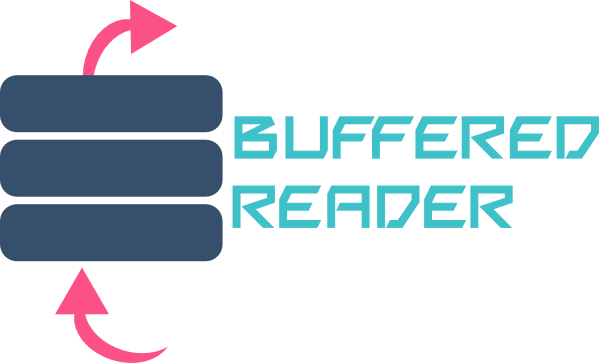

# BufferedReader

`BufferedReader` allows you to create a buffer of results from asynchronous requests. This is not to be confused with Node.js' native `Buffer` type, this is a temporary store that we populate with results of asynchronous requests for the event loop to consume.

The `BufferedReader` can be used as a drop in replacement for your asynchronous function call, and it will fill a buffer of responses for your request.

# Why does this exist?

When modeling some applications, you may find yourself using a waterfall pattern loading in content that you want to perform an action on. Maybe something like this:

```js
async.waterfall([
    function fetchFromSQS...,
    function fetchFromS3...,
    function convertToDocument...,
    function InsertIntoElasticsearch...
])
```

You may run this waterfall in a loop. The time your event loop spends waiting for the object from S3 and inserting into Elasticsearch could be spent loading the next message from SQS. This module facilitates for that in an easy to consume pattern.

# Installation

`npm install buffered-reader`

# Usage

```
var BufferedReader = require('buffered-reader')

var sqsBuffer = new BufferedReader(10, fetchFromSQS)

sqsBuffer(function fetchedMessage(e, message) {
  console.log(JSON.stringify(message))
})

function fetchFromSQS (cb) {
  // Do all async stuffs...
  return cb(e, message)
}
```

# API

### `reader = new BufferedReader(bufferLength, function populateBuffer`

Creates a new `BufferedReader` instance.

`bufferLength` is an integer that defines how deep of a buffer the reader should attempt to maintain. For example, if you specify `10` here, the reader will hold at most 10 responses in memory at any one time.

`populateBuffer` is the function that the reader will use to populate the buffer. It should be in the form of `function populateBuffer(cb)`. The callback provided to your function should be called with the response of your function (irrespective of whether or not it is asynchronous). The values passed to the callback will be passed directly back to you out of the buffer in the same exact order. For example:

```
cb(`foo`, `bar`, `buzz`)
```

Will pass `foo`, `bar`, `buzz` back to you in that exact order during the next invocation of `reader`. It is important to note here that we do not attempt to identify errors. If an error occurs, your invocation of `reader` should handle that error and move forward with life.

### `reader(function getResponse)`

`getResponse` is a function that receives the results of the `populateBuffer` function that the reader was initialized with during construction. This may block while waiting for a result to be placed in the buffer.
